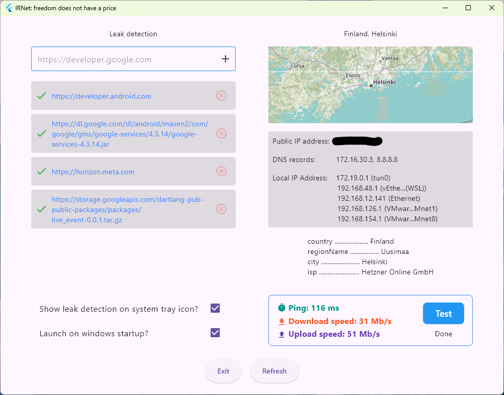

# ir_net

Windows tool to show VPN connection details



## Features
- Show location of connection in map
- Leak detection on your urls
- SysTray icon without the app being open
- Start by windows startup
- Ability to minimize and hide from taskbar
- Show details of your ISP
- Update status when there is a network change
- Connect through proxy vpn types (eg. ShadowSocks, VMess, ...)

## How to install .msix file
Currently to be able to install the .msix file you should accept our signature by doing below steps:

- Right-click on the .msix file and select Properties
- Go to the Digital Signatures tab inside the Properties dialog
- Select the “buildtoapp.com” signer and click Details. Then click on View Certificate
- Start installing the certificate by clicking on Install Certificate
- Select Local Machine in the dialog. Click Next
- Under “Place all certificates in the following store”, click Browse
- Select the Trusted Root Certification Authorities folder. Click OK
- Click Next and then Finish
- Now, double-click on the file. You’ll see that the Install button is now enabled. Click on it to install the app

## Commands
Create .msix file:
```bat
flutter pub run msix:create
```

## TODO
- Show DNS addresses
- Add alternative api service
- Choose default country and show flag based on that
- Option to show all countries flag
- Add statistics eg. (number of times and minutes there was a network error, reasons of network failure)
- Add app launcher icon
- Show error reason in leak detection list
- Show which app occupied a port
- Speed test
- Shortcuts to important screens of windows (eg. Network adapters)
- Retry one more time if there was a leak found during switch to new network
- Reset ip lookup result when there is no network
